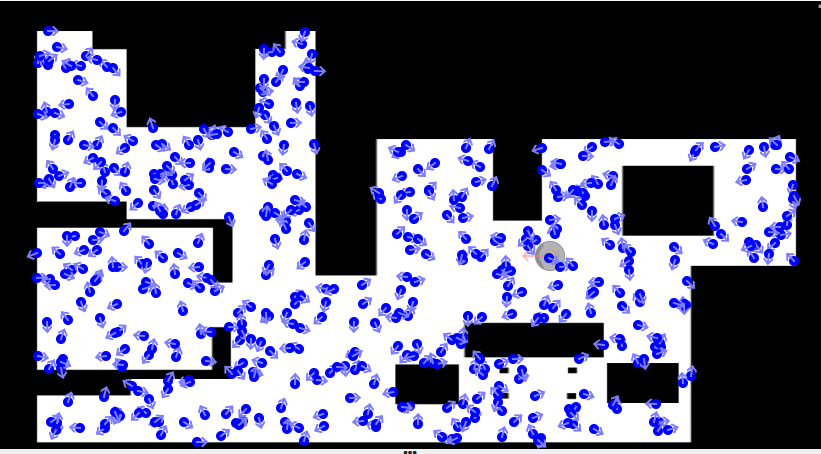
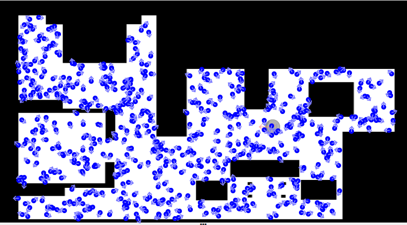

# P5 - Montecarlo Laser Localization
**Date:** 22/12/2024

**Author:** Andrés Galea Torrecilla

**Execution video:** 

## Algorithm details:
The goal is to program a localisation algorithm based on the **Monte Carlo algorithm**. The developed algorithm shall estimate the position of the robot on the map.

### Particle initialization:
To initialize the set of samples I follow the next procedure:
- Store in a **numpy** array all the free zones indexes of the map.
- Randomly choose *NPARTICLES* indexes of that array.
- For *NPARTICLES* to create, create a particle with the coordinates stored in that index of the array but in world coordinates format and add to the particle a randomly chosen orientation between 0 and 2pi.
- Assign the initial probability **1 / NPARTICLES** to every particle

This is are examples of the result (assigning 1 probability to all particles so that they can be seen):
##### 500 particles

#### 600 particles

### Particle propagation:
The propagation of particles is made using the function **HAL.getOdom()**. The idea is to use the odometry to estimate the displacement that the robot has made to apply it to all particles.
This is calculated by subtracting the odometry in **t** minus the robot odometry in **t^-1** and adding some **noise** to the result. This is due to some reasons:
- The robot movement is neither exact nor deterministic.
- To prevent particles from staying always in the same area, which may result in the particles not being able to localise properly.

### Particle weight assingment:
For particle weight assignment, I use:

### Particle resampling:

### Optimisation techniques

## Obtained results:
The taxi is able to navigate through the map to reach the chosen target. If the target is modified during the taxi navigation to the target, the taxi stops, create a new **final cost map** and starts to navigate to the new target. The **final cost map** creating proccess cannot be interrupted.

## Difficulties:

  - Find an appropiate **extra cost** for each layer of the square around the obstacle so that it is relevant but does not prevent the taxi from being able to pass through some streets in addition to determining appropiate dimensions for the square.

  - Find the dimensions of the square to expand around the taxi to get the cell with less cost.

  - Find a way to calculate angular and linear speeds so that the car moves securely.

  - When the target is behind the initial position of the taxi there are some cases in which when it starts to turn around it collides with the wall. I tried to solve it by making **zero or near-zero** linear speed at **big turns (high angular speed)**. I did this by increasing the *LIMIT FACTOR*. I leave commented the previous *LIMIT FACTOR* value with which the taxi had some linear speed also in big turns.
